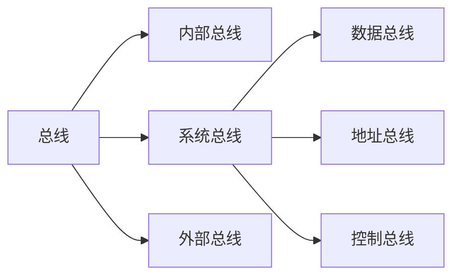
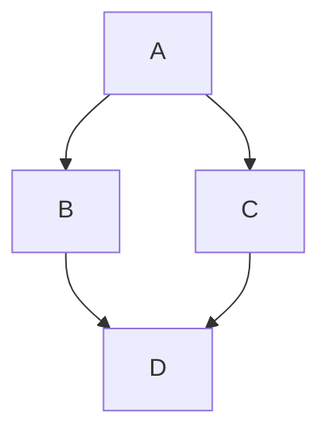
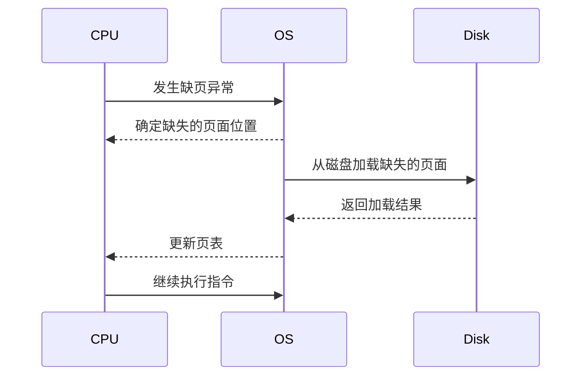
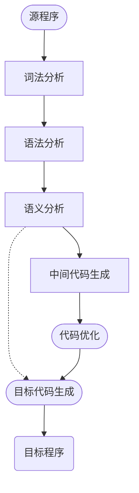

---

title:  软考笔记 - 软件设计师中级
date: 2024-04-01
category: 
 - software
tag: 
 - Engineering
sidebar: heading

---

> 软考低空飘过～保留一份笔记

## 1 计算机组成与体系结构

### 层次化存储结构

### Cache 概念

- **功能:** 提高CPU数据输入输出的速率，突破冯·诺依曼瓶颈，即CPU与存储系统间数据传送带宽限制。
- 在计算机的存储系统体系中，Cache是访问速度最快的层次。
- 使用Cache改善系统性能的依据是程序的局部性原理。

如果以代表对Cache的访问命中率，表示 Cache 的周期时间，表示主存储器周期时间，以读操作为例，使用“Cache+主存储器”的系统的平均周期为，则:

$$
t_3= h * t_1+(1-h)*t_2
$$

其中，(1-)又称为失效率(未命中率)。

### 局部性原理

- 时间局部性，刚刚访问完的东西，再次访问
- 空间局部性，比如数组，访问一个空间，再次访问临近空间
- 工作集理论：工作集是进程运行时被频繁访问的页面集合

### 主存

#### 分类

- 随机存取存储器， RAM
- 只读存储器，ROM

#### 编址

8\*4位存储，000 \~ 111为地址单元，每一个单元有4位存储单元

8\*8位存储，000 \~ 111为地址单元，每一个单元有8位存储单元

16\*4位存储，0000 \~ 1111为地址单元，每一个单元有4位存储单元

题目：

答案：

地址单元： $C7FFFH - AC000H + 1= 17000H$

地址单元K： \$17000H/2^{10}=112K

\$

总存储位数： $28*16K*x=112K*16,  x = 112*16/(28*16)=4$

(1)B (2) A

### 磁盘结构与参数

存取时间=寻道时间+等待时间（平均定位时间+转动延迟）

寻道时间：刺头移动到磁道所需的时间

等待时间：等待读写的扇区转到磁头下方所用的时间

### 总线

### 系统可靠性分析与设计

#### 串联系统与并联系统

串联系统

可靠度 $R = R_1 \times R_2 \times ... \times R_n$

失效率（近似） $\lambda = \lambda_1 + \lambda_2 + ... + \lambda_n$

并联系统

可靠度 $R = 1- (1 - R_1) \times (1 - R_2) \times ... \times (1 - R_n)$

失效率 $\mu = \frac{1}{\frac{1}{\lambda}\sum\limits_{j=1}^{n}\frac{1}{j}}$ ，一般使用 $\mu = 1 - R$

#### n模冗余系统与混合系统(不重要)

$R = \sum\limits_{i = n+1}^{m}C_{m}^{j}\times R_{0}^{i}(1-R_0)^{m-1}$

#### 差错控制 - CRC与海明威校验码

**检错与纠错**

**什么是码距?**一个编码系统的码距是整个编码系统中**任意(所有)** 两个码字的最小距离。

例:
若用1位长度的二进制编码。若A=1，B-0。这样A，B之间的最小码距为1。
若用2位长度的二进制编码，若以A=11，B-00为例，A、B之间的最小码距为2。
若用3位长度的二进制编码，可选用111，000作为合法编码。A，B之间的最小码距为3。

**纠错与最小码距**

1. 一个码组内为了检测e个误码，最小码距满足: d ≥ e+1
2. 一个码组内为了纠正t个误码，最小码距满足: d ≥ 2t+1

##### 循环校验码CRC

功能：是一种可以检错，无法纠错的一种校验码；结果与生成多项式做模2除法的计算结果不为0

模2除法：在做除法运算的过程中不计其进位的除法；不是计算差，而是对位进行异或运算；

1. 在原始报文后加  生成多项式位数-1 个0&#x20;
2. 进行模2除法 ，求余
3. CRC编码 = 原始报文+余

## 2 操作系统基本原理

\*\*操作系统： \*\*

- 管理系统的硬件，软件，数据资源
- 控制程序运行
- 人机之间的接口
- 应用软件与硬件之间的接口

**操作系统的管理职能：**

- 进程管理
  - 进程的状态
  - **前驱图**
  - **PV操作**
  - 死锁问题
- 存储管理
- 文件管理
- 作业管理
- 设备管理
- 微内核操作系統

### 进程管理

#### 进程的状态

**三态模型**

**五态模型**

#### 前驱图

一种用于表示**一组操作**间**先后顺序**关系的**有向图**

主要用途之一是在事务调度和并发控制中检测冲突。

在这个前驱图示例中，有四个操作：A、B、C、和D。图中的箭头表示一个操作必须在另一个操作之前执行的顺序。具体来说：

- 操作A是操作B和操作C的前驱，意味着操作A必须在操作B和操作C之前执行。
- 操作B和操作C都是操作D的前驱，这表示操作D必须在操作B和操作C之后执行，但操作B和操作C之间的执行顺序并未指定。

#### 同步与互斥

同步（Synchronization）

- 通常涉及到一组进程或线程在特定点上相互等待，以确保某些操作按照正确的顺序发生
- 主要目的：协调需要按照特定顺序访问共享资源或执行操作的进程或线程

互斥（Mutual Exclusion）

- 并发控制的一种形式
- 同一时间只允许一个进程或线程访问共享资源
- 主要目的是防止多个进程或线程同时对同一共享资源进行读写操作

同步与互斥的关系

- 互斥是实现同步的一种手段
- 同步不仅包括了互斥控制，还涵盖了进程和线程之间的协调和通信

#### PV操作！！

- 临界资源：进程间需要互斥方式对其进行共享的资源，比如打印机，磁带机等
- 临界区：进程中访问临界资源的那段代码被称为临界区
- 信号量：一种特殊的变量

P操作（Proberen，尝试），用于申请资源，是一个阻塞操作。

- 如果信号量的值大于0，表示资源可用，进程会将信号量的值减1，然后继续执行。
- 如果信号量的值为0，表示没有可用资源

V操作（Verhogen，增加），用于释放资源，是一个非阻塞操作

- V操作会将指定的信号量的值加1，表示释放了一个资源单位。
- 如果有其他进程因为P操作而被阻塞在该信号量上，增加信号量的值可能会导致一个或多个等待的进程被解除阻塞

PV操作通常用于实现互斥锁（Mutex）和信号量（Semaphore）：

- **互斥锁**：通过一个初始值为1的信号量实现，确保同一时间只有一个进程可以进入临界区。进入临界区前执行P操作，退出临界区后执行V操作。&#x20;
- **信号量**：可以是一个初始值大于1的信号量，允许多个进程同时访问资源或执行任务，但总数受信号量的初始值限制。进程在访问共享资源前执行P操作，在访问完成后执行V操作。

#### 死锁问题

##### 基本计算

$$
min = k\times(n - 1) + 1
$$

k个进程，每个进程需要n个资源，则至少需要min个资源才不会发生死锁。

例题：

系统有3个进程:A、B、C。这3个进程都需要5个系统资源。如果系统至少有多少个资源，则不可能发生死锁。

min = 3 \* (5 - 1) + 1 = 13

##### 死锁预防

- 有序资源分配：资源利用率较低
- 银行家算法
  - 一个进程对资源的最大需求量不超过系统资源数时，可以接纳该进程
  - 进程可以分期请求资源，但总数不能超过最大需求
  - 现有资源不能满足进程所需，对进程的请求可以推迟，但总能使进程在有限时间内得到资源

### 存储管理

#### 分区存储组织

- 首次适应法
- 最佳适应法：空闲区块，按照大小顺序先连成链，然后按照空间进行比较分配；缺点：存储空间会产生很多小的碎块
- 最差适应法：与最佳相反，按照相反顺序连成链，再分配
- 循环首次适应法：将区块连成链，不分大小，再循环分配，尽量平均

#### 页式存储组织

- 高级程序语言使用逻辑地址
- 运行状态，内存中使用物理地址

**实现**

- 将用户程序分成等分大小的页 → 页号
- 把内存中的存储区也分成等分大小的块 → 块号、页帧号
- 使用页表来进行关联：页号→块号

**特点**

- 优点：利用率高，碎片小，分配及管理简单
- 缺点：增加了系统开销；可能产生抖动现象

#### 段式存储组织

按照逻辑结构划分，每一段地址空间大小不一定

**特点**

- 优点：多道程序共享内存，各段程序修改互不影响
- 缺点：内存利用率低，内存碎片浪费大

#### 段页式存储组织

先分段，再分页

**特点**

- 优点：空间浪费小，存储共享容易，存储保护容易，能动态连接
- 缺点：复杂性和开销随之增加，需要的硬件以及占用的内容也有所增加，执行速度大大下降

#### 快表

快表是一块小容量的相联存储器（Associative Memory），也由高速缓存器（Cache）组成，速度快，且可以从硬件保证内容并行查找，一般用于存放当前访问最频繁的少数活动页面的页号

#### 页面置换算法

- 最优算法（Optimal， OPT），通常作为对比方案
- 随机算法（RAND）
- 先进先出（FIFO）：有可能产生抖动（抖动：刚换出的页面又马上回入，刚换入的页面又换出，的频繁调度行为）
- 最近最少使用（LRU）不会抖动

如下：先进先出的贝拉迪异常（Belady），分配的块数增多，但缺页率却在上升

PS:  行首为访问页序列，

- 若内存空间中没有页，则标记缺页，并将页加载到内存空间中；
- 先进先出，总共有3页内存空间，内存空间加载满之后，最先加载的页先出

如下对比FIFO与LRU

**例题**

7/7

**指令的缺页异常**

当一个指令跨越多个页时，如果其中一个页不在内存中，就会触发缺页异常。在处理这个缺页异常时，操作系统可能会一次性加载所有缺失的页面，而不是每个页面触发一次缺页异常。因此，即使指令跨越多个页，也可能只触发一次缺页异常。

### 文件管理

#### 索引文件结构

- 一个索引节点，对应物理盘块(磁盘数据块)或磁盘索引块
- 索引盘块与物理盘块一般都有大小限制
- 索引盘块可以存放的索引/地址项数量，与索引盘块的大小，和每个地址项的大小有关；

最大索引文件大小 = （直接索引物理盘块+ 一级索引的物理盘块 +...+ N级索引物理盘块）\* 物理盘块大小

**例题**

C, D

#### 文件和树形目录结构

- 绝对路径：从盘符开始的路径
- 相对路径：从当前路径开始的路径

#### 空闲存储空间管理

- 空闲区表法（空闲文件目录）
- 空闲链表法
- **位示图法**
- 成组链接法

##### 位示图法

- 位示图中，每一个单元为一个物理块、数据块
- 每一行为一个索引对应的磁盘数据块

**例题：**

D、B

### 设备管理

#### 数据传输控制方式

- 程序控制方式/程序查询方式，CPU介入最多的方式
- 程序中断方式
- DMA方式
- 通道
- 输入输出处理机&#x20;

#### 虚设备与SPOOLING技术

SPOOLING技术开辟了缓冲区

SPOOLING（Simultaneous Peripheral Operation On-Line）技术是一种通过在内存中缓冲数据来提高I/O设备效率的技术。

在使用SPOOLING技术时，数据首先被缓冲到输入输出缓冲区中，然后再由虚拟设备统一管理和处理，最终传输到物理设备中进行实际的I/O操作。

这样可以提高设备的利用率和性能，并且能够实现并行处理多个设备上的数据。

### 微内核操作系统

**主要了解****用户态****与****核心态****的区分**

- 户态的故障一般不会影响系统使用
- 核心态与用户态存在交互

| **内核类型** | **定义**                                                                        | **优点**                                                     | **缺点**                              |
| -------- | ----------------------------------------------------------------------------- | ---------------------------------------------------------- | ----------------------------------- |
| **微内核**  | 将核心功能模块化，只实现基本功能&#xA;图形系统、文件系统、设备驱动及通信功能以服务的方式运行在用户空间。&#xA;通过消息传递机制进行通信和协同工作。 | 内核精炼，便于剪裁和移植&#xA;系统服务程序运行在用户地址空间，可靠性，稳定性，安全性高&#xA;可用于分布式系统 | - 性能损耗 &#xA; \- 复杂性高 &#xA; \- 资源消耗多 |
| **单体内核** | 将图形、设备驱动、文件系统功能集成在一个内核空间中&#xA;运行在内核状态和同一个地址空间                                 | 减少进程间通信和状态切换的系统开销，运行效率高                                    | 内核庞大，占用资源多，不易剪裁&#xA;稳定性和安全性较差       |

## 3 数据库系统

- 数据库模式
- ER模型
- 关系代数与元组演算
- 规范化理论
- 并发控制
- 数据库完整约束
- 分布式数据库
- 数据仓库与数据挖掘

### 三级模式 - 两级映射

三级模式

- 内模式：物理数据库层次
- 概念模式：概念层级
- 外模式：用户应用程序

两级映射：

- 外模式-概念模式映射：用户试图→概念级数据库
- 概念模式-内模式映射：DBA视图→物理级数据库

### 数据库设计过程

需求分析：产出数据流图，数据字典，需求说明书

概念结构设计：产出ER模型（规范化理论）

逻辑结构设计：产出关系模式

物理设计

#### E-R模型

**集成的方法：**

- 多个局部E-R图一次集成
- 逐步集成，用累加的方式一次集成两个局部E-R。

一般都是逐步集成

**集成产生的冲突及解决办法：**

- 属性冲突：包括属性域冲突和属性取值冲突
- 命名冲突：包括同名异义和异名同义
- 结构冲突：包括同一对象在不同应用中有不同的抽象，以及同一实体在不同局部ER图中所包含的属性个数和属性排列次序不完全相同

**关系**模式

一个实体转成一个关系模式：

- 1:1联系，转成两个关系模式
- 1:n联系，
- m:n联系

Q: 关系模式到底是什么？

#### 关系代数

- 并
- 交
- 差
- **笛卡尔积**，两个表做积操作，取两个表所有字段
- 投影，选列的操作
- 选择，选行的操作
- **联接**，两个表相同字段做等值比较，取所有字段，去掉相同字段

### 规范化设计

#### 函数依赖

#### 价值和用途

非规范化的关系模式，可能存在的问题包括：数据冗余、更新异常、插入异常、删除异常

规范化与逆规范化

#### 键

(学号，姓名，身份证）→性别

- 学号和姓名，身份证的组合键，可以称之为超键
- 移除姓名（冗余键），可以作为候选键
- 身份证、学号，任选一个，可以作为主键
- 外键，关联查询所用的键，比如班级号，可以确认班主任ID

#### 求候选键

- 将关系模式的函数依赖关系用“有向图”的方式表示
- 找入度为0的属性，并以该属性集合为起点，尝试遍历有向图，若能正常遍历所有结点，则该属性集为关系模式的候选键
- 若入度为0的属性集不能遍历所有结点，则尝试性的将一些中间节点并入入度为0 的属性集中，直至集合能遍历所有结点，集合为候选键

例题：

A, ABCD, B

#### 范式

规范化程度越高，数据密度越低。范式提高一般需要拆表

- 第一范式，属性值都是不可分的原子值
- 第二范式，笑出了第一范式非主属性对候选键的部分依赖.
- 第三范式，消除了第二范式非主属性对候选键的传递依赖
- BCNF，消除主属性对候选键的传递依赖

C,D,A

#### &#x20;模式分解

- 保持函数依赖分解：分解之前有哪些函数依赖，分解后依然存在
- 无损分解：有损：不能还原；无损：可以还原
  - 无损联接分解：将一个关系模式分解成若干个关系模式后，通过自然联接和投影等可以还原到原来的关系模式

### 并发控制

#### 基本概念

- 事务：原子性、一致性、隔离性、持续性
- 并发产生的问题→封锁协议→死锁问题

#### 存在的问题

**丢失更新：** T1、T2都先读出了数据，然后分别更新，最后写入一个结果，其中一个更新丢失

**不可重复读：** T1读第二次时，数据已经被T2更新，导致T1验算失败

**读脏数据：** T1执行中缓存数据，T2读取值，T1再进行Rollback，T2读取的实际是脏数据

#### 封锁协议

- 一级封锁协议：事务在修改数据R之前，必须对其加X锁（写锁），直到事务结束才释放。**可防止丢失修改**
- 二级封锁协议：一级封锁协议基础上，事务T在读取数据R之前先对其加S锁，读完后即可释放S锁 （读锁）。**可防止丢失修改，和读脏数据**
- 二级封锁协议：二级封锁协议基础上，事务T在读取数据R之前先对其加S锁，事务结束后才释放。**可防止丢失修改，读脏数据**，与防止数据重复读
- 两端锁协议。可串行化的，可能产生死锁

### 数据完整性约束

简单约束

- 实体完整性约束：主键
- 参照完整性：外键
- 用户自定义完整性约束

复杂约束

- 触发器：脚本约束

### 数据库安全

#### 数据备份

#### 数据库故障与恢复

#### 数据仓库与数据挖掘

目前主要场景如BI

- 面向主题
- 集成的
- 相对稳定的（非易失的）
- 反映历史变化（随着时间变化）

##### 数据挖掘方法分类

- 决策树
- 神经网络
- 遗传算法
- 关联规则挖掘算法

分类：

- 关联分析
- 序列模式分析
- 分类分析
- 聚类分析

### 反规范设计

规范化会使表不断地拆分，从而导致数据表过多。虽然减少了数据冗余，提高了增删改的速度，但会增加查询的工作量。系统需要进行多次连接，才能进行查询操作，使得系统效率大大下降

**目的：** 提高查询速度。

**技术手段**

- 增加派生性冗余列
- 增加冗余列
- 重新组表
- 分割表

### 大数据

- 数据量大：Volume
- 速度：Velocity
- 多样性：Variety
- 值：Value

## 4 计算机网络

### 七层模型

- 计算机网络七层模型
  - 7 应用层
    - 应用协议
      - HTTP
      - FTP
      - SMTP
      - POP3
      - IMAP
      - DNS
    - 应用功能
      - 网络应用
      - 信息传递
      - 网络通信
  - 6 表示层
    - 协议
      - 同应用层
    - 功能
      - 数据的格式与表达
      - 数据加密
      - 数据压缩
  - 5 会话层
    - 协议
      - 同应用层
    - 功能
      - 建立会话
      - 管理会话
      - 终止会话
  - 4 传输层
    - 端口
      - 端到端的连接
      - TCP
      - UDP
    - 传输功能
      - 数据可靠传输
      - 网络分割
      - 数据复制
  - 3 网络层
    - IP地址
      - IPv4
      - IPv6
    - 网络功能
      - 寻址
      - 路由选择
      - 流量控制
  - 2 数据链路层
    - MAC地址
      - MACv4
      - MACv6
    - 链路功能
      - 帧同步
      - 数据交换
      - 差错控制
  - 1 物理层
    - 传输介质
      - 电缆
      - 光缆
      - 无线
    - 传输速率
      - 10Mb/s
      - 100Mb/s
      - 1Gb/s
      - 10Gb/s

**例题：**

### 网络技术标准与协议

- TCP/IP协议：Internet，可扩展，可靠，应用最广，牺牲速度和效率
- IPX/SPX协议：NOVELL，路由，大型企业网
- NETBEUI协议：IBM，非路由，快速

#### DHCP协议

- 客户机/服务器模型
- 租约默认8天
- 租约过半时，客户机需要向DHCP服务器申请续租
- 租约超过87.5%时，如果仍没有和提供IP的DHCP服务器联系上，则开始联系其他DHCP服务器
- 固定分配、动态分配、自动分配
- 169.254.x.x和0.0.0.0  假地址

#### DNS协议

主要区分迭代和递归查询的区别。

- 迭代查询：请求-回复 的结构
- 递归查询：直到查到目标IP为止

**例题**：

### 网络分类

#### 拓扑结构

按分布范围：

- 局域网
- 城域网
- 广域网
- 因特网

按拓扑结构分：

- 总线型
- 星型：本地组网，一般是星型结构
- 环形

### 网络规划与设计

#### 逻辑网络设计

利用需求分析和现有网络体系分析的结果来设计逻辑网络结构，最后得到一份逻辑网络设计文档，包含：

- 逻辑网络设计图
- IP地址方案
- 安全方案
- 软硬件、广域网连接设备和基本服务
- 招聘和培训网络员工的具体说明
- 对软硬件、服务、员工和培训的费用估计&#x20;

#### 物理网络设计

对逻辑网络设计的物理实现，通过对设备的具体物理分布、运行环境等确定，确保网络的物理连接符合逻辑连接要求

- 网络物理结构图和布线方案
- 设备和部件的详细列表清单
- 软硬件安装费用估算
- 排期
- 测试
- 培训

#### 分层设计

- 核心层：数据交换、转发，设备性能和可靠性高，要有冗余设计
- 汇聚层
- 接入层

#### IP地址

第一阶段，地址分类

- 地址进行了分类，A、B、C、D类组播，E类保留；
- 主机号全0为网络地址，全1为网播地址
- A类地址，首位为0，前一段(8位)为网络号，后3(段)24位为主机号，主机数量 2 ^24 - 2
- B类地址，第2位为0，前二段(16位)为网络号，后二段(16位)为主机号，主机数量 2 ^16 - 2
- C类地址，第3位为0，前三段(24位)为网络号，后一段(8位)为主机号，主机数量 2 ^8 - 2

第二阶段，子网划分

将A\B\C类地址，拆分为更小的批次，比如1000台为一组，前n位为子网号，后m位为主机号

第三阶段，无分类编址

172.18.129.0/**24**，代表了前24位为网络号，后8位为主机号，主机数量为 2^8 - 2 = 254

例题1：将B类IP地址168.195.0.0划分为27个子网，子网掩码为多少？

- 27个子网，2^5 = 32 > 27⇒ 需要5个子网号
- B类地址，前2段为网络号
- 前21为1，255.255.248.0

例题2：将B类IP地址 168.195.0.0划分为若干个子网，每个子网内有主机700台，子网掩码为多少？

- 2^10→1024 > 700 ⇒ 需要10个子网号
- B类地址，前2段为网络号
- 前24为1，255.255.252.0

例题3：分配给某公司网络的地址块是210.115.192.0/20，该网络可以被划分为（  ）个C类子网。

A. 4       B. 8     C. 16    D. 32

前20位为子网，C类网络取前24位，则21-24 4个位可以用于划分为2^4=16个

##### 特殊IP地址

| **IP**         | **说明**                      |
| -------------- | --------------------------- |
| 127网段          | 回拨地址                        |
| 网络号全0地址        | 当前子网中的主机                    |
| 全1地址           | 本地子网的广播                     |
| 主机号全1地址        | 特定子网的广播 192.168.255.255     |
| 10.0.0.0/8     | 10.0.0.1至10.255.255.254     |
| 172.16.0.0/12  | 172.16.0.1至172.31.255.254   |
| 192.168.0.0/16 | 192.168.0.1至192.168.255.254 |
| 169.254.0.0    | 保留地址，用于DHCP失效（Win）          |
| 0.0.0.0        | 保留地址，用于DHCP失效（Linux）        |

### 计算机网络与信息安全

##### HTML

略

#### 无线网

优势：

- 移动性
- 灵活性
- 成本低
- 容易扩充

接入方式：

- 有接入点模式
- 无接入点模式

分类

- 无线局域网，802.11，Wi-Fi
- 无线局域网，802.16，WiMax
- 无线局域网，3G/4G
- 无线局域网，802.15，蓝牙，zigbee

## 5 系统安全分析与设计

### 信息系统安全属性

- 保密性：最小授权原则、防暴露、信息加密、物理加密
- 完整性：安全协议、校验码、密码校验、数字签名、公证
- 可用性：综合保障（IP过滤、业务流控制、路由选择控制、审计跟踪）
- 不可抵赖性：数字签名

### 加密

对称加密技术和非对称加密技术

#### 对称加密技术

常见加密算法

- DES：替换+移位、56位密钥、64位数据块、速度快、密钥易产生；

  3DES（三重DES）：两个56位密钥K1、K2 。
  - 加密：K1加密→K2解密→K1加密
  - 解密：K1解密→K2加密→K1解密&#x20;
- AES：高级加密标准Rijndael加密法，美联邦采用的一种区块加密标准。要求“至少与3DES一样安全”
- RC-5：RSA数据安全公司的很多产品都是用了RC-5
- IDEA：128密钥、64位数据块，比DES加密性好、对计算机功能要求相对低，PGP

缺点：加密强度不高，密钥分发困难

#### 非对称加密技术

常见加密算法：

- RSA：512位（或1024位）密钥、计算量极大、难破解
- Elgamal：基础是Diffie-Hellman密钥交换算法
- ECC：椭圆曲线算法
- 其它非对称算法包括：背包算法、Rabin、D-H

缺点：加密速度慢

### 信息摘要

常用的信息摘要算法：

- MD5，128位
- SHA，160位

SHA密钥长度长，所以安全性高于Md5

信息摘要，主要用于数据验证

### 数字签名

防抵赖的方式，可以确定"发送者"的身份。

用私钥进行加密，并发布，则可以使用公钥进行解密。使用公钥进行解密的过程一般称为数字签名的验证，用私钥加密的过程称之为数字签名

### 数字信封与PGP

- 发送方将原文用对称密钥加密传输，而将对称密钥用接收公钥加密发送给对方
- 接收方收到电子信封，用自己的私钥解密信封，去除对称密钥解密得原文

PGP数字证书：

一般携带了身份信息。

- PGP可用于电子邮件，也可以用于文件存储。采用了杂合算法， 包括IDEA、RSA、MD5、ZIP数据压缩算法
- PGP承认两种不同的证书格式：PGP证书和X.509证书
- PGP证书包含PGP版本号、证书持有者的公钥、证书的有效期、密钥首选的对称加密算法
- X.509证书包含证书版本、序列号、签名算法表示、证书有效期、证书发行商名字、证书主体名、主体公钥信息、发布者的数字签名

例题：设计邮件加密系统

要求邮件以加密方式传输，邮件最大附件内容可达500MB，发送者不可抵赖，若被第三方截获，第三方无法篡改

1. 发送文件较大，需要使用对称加密技术
2. 发送者不可抵赖，则需用私钥进行数字签名→摘要
3. 第三方无法篡改，则可使用对方的私钥进行加密，第三方无法进行解密。接收方收到后，使用私钥进行解密

解析：分析一下以上几个问题1、对称加密，2、数字签名，3、信息摘要。

上述答案中，第二点的问题在于，数字签名并不是用私钥进行加密，而是使用公钥，且实际上并不需要说明是公钥还是私钥；数字签名的过程也许会和摘要有关，但是这个不是数字签名的目的。第三点，使用对方的私钥进行加密，实际是无法获取对方私钥。

正确的情况是：

1. 对称加密，使用随机密钥K，对邮件正文进行加密，将正文密文法给接收方
2. 数字签名，发送方对邮件摘要进行数字签名，将摘要密文发送给接收方；接收方接收密文，验证签名，获取解密后的摘要
3. 随机密钥K，使用对方公钥进行加密，发送给接收方；接收方收到后，使用私钥解密，获取密钥K
4. 使用密钥K，解密正文；获取邮件摘要，与解密后的摘要进行对比，保证没有被篡改

### 网络安全

#### 各个网络层次的安全保障

#### 网络威胁与攻击

#### 防火墙

- 网络级
- 应用级

## 6 数据结构与算法

- 数组与矩阵
- **线性表**
- 广义表
- **树与二叉树**
- 图
- **排序与查找**
- **算法基础及常见的算法**

## 7 程序设计语言基础

### 文法定义

- 有序四元祖G=(V, T, S, P)

### 语法推到树
